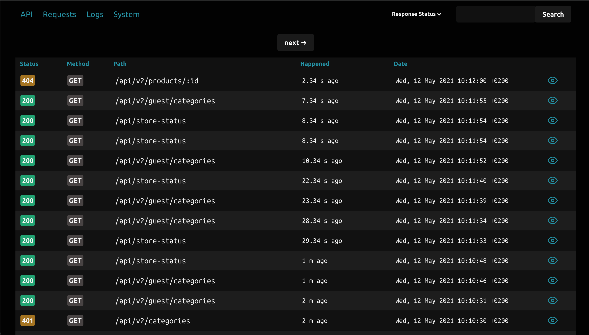
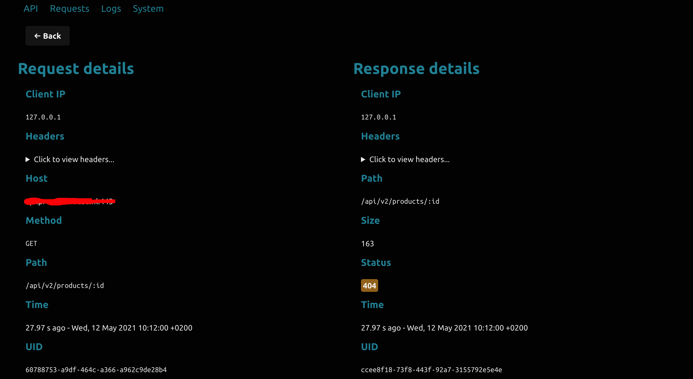
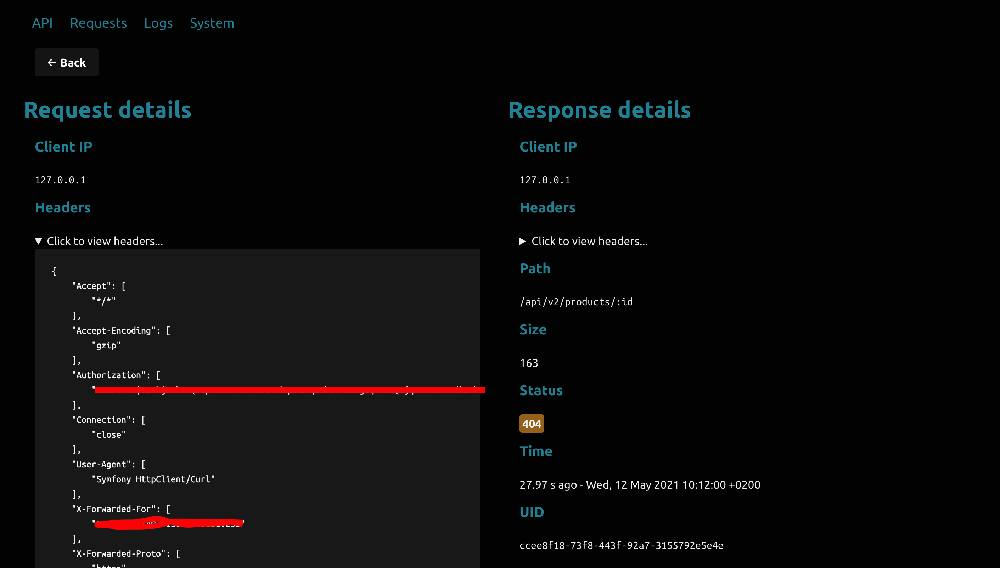
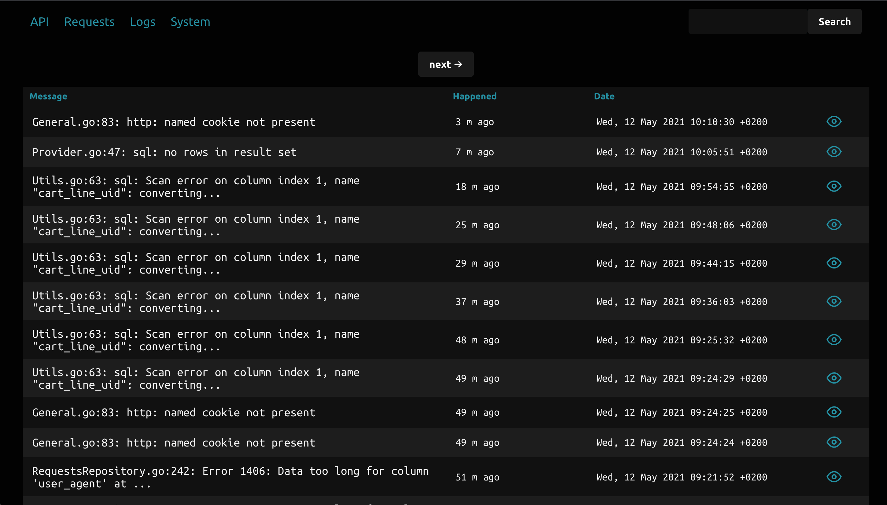
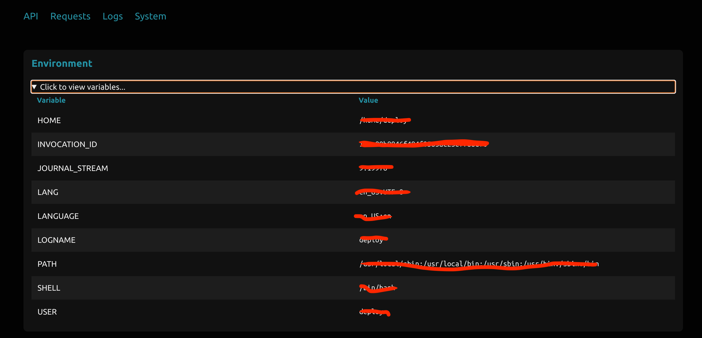
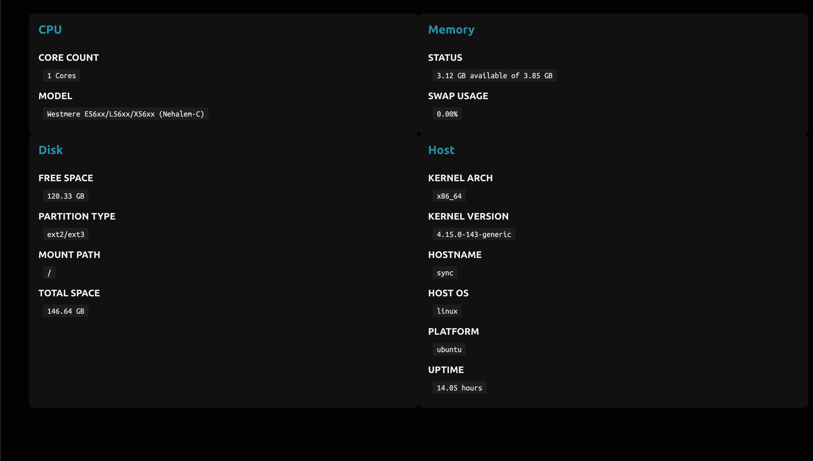

# GoScope

Watch incoming requests and outgoing responses from your Go Gin application. All is logged into a database for persistence and paginated for performance.

The aim of this application is to be a plug and play addition to your application, not a hurdle, thus to setup, you only require a one-liner in your main function.

Once all is set up you can access the web interface by visiting `http://your-app.com/goscope`. 

You should protect this route from external/public access so that you do not leak important application data.

GoScope requires a Go version 1.16 or higher.

### Setup

GoScope has been extended to work with a repository pattern, thus has the capability of supporting any database driver/engine that will work with Go and uses the `sql` package (returning `*sql.Rows` or `*sql.Row`). 
NoSQL databases are not currently supported, although we think that it would be a great addition, so if you have the know-how please don't hesitate to make a Pull Request.
In the .env file you can specify either the `mysql` driver, `postgres` driver, or `sqlite3` driver, which will use the `github.com/go-sql-driver/mysql`, `github.com/lib/pq` or `github.com/mattn/go-sqlite3` respectively. Ensure you have the correct connection string in your env file.

The application expects a database with a setup that can be recreated by taking a look at the `setup` folder in the root of this repository.

### Example

To understand more about the required variables to initialise GoScope, take a look at the [.env](examples/.env) file in the source of this repository. That is a simple example of what you could do. I personally prefer using `.toml` files and loading them via [spf13/viper](https://github.com/spf13/viper), and I have made GoScope flexible for that purpose, whatever config manager you use is up to you.

The documentation of this package should also elucidate more on that matter. Take a look at the [type definition](pkg/goscope/Types.go) and see `Environment`.

Please note that you should use plain gin without middlewares, since GoScope will use Gin Gonic's logger and recovery middlewares, but with a customized twist, thus the requirement is that initially you have a clean `gin.Engine` instance.

Take a look at the example implementation in [main.go file](cmd/goscope/main.go)

### Contributing

Your help and ideas are needed to keep this project moving forward to become a more powerful tool commit by commit. Any bug that you may find is something that will make GoScope more robust. Whether you are more front-end or back-end there is work here for you. Take a look at the [contributing guidelines](CONTRIBUTING.md)

### API Documentation

GoScope is in its essence a middleware, a backend in Go and a front-end in Vue.js, thus you can hook onto the backend with any tool of your choice, being it other kinds of front-ends or monitoring tools like Zabbix or others. 
For that purpose please find here the [API spec](SPEC-API.md).

### Request & Response

In order to understand possible unexpected situations or simply to reassure you that everything is working correctly, GoScope provides more detailed information about request and response, including status codes and request/response bodies, as well as any useful information. Any help with expanding this would be greatly appreciated.

### Logging

GoScope hooks into the logging mechanism of your application by using a custom `io.Writer`. 
This prints to the console for ease of development and saves the logs into the database, for further displaying in the web environment.
Thus you only need to call your usual `log.Println` or `log.Printf` statements or any variants of the log writing package, and that will seamlessly be picked up by GoScope.

Alternatively you can use syslog style log functions, which follow the standard:
- Emergency (0 - EMERGENCY) - `goscope.LogEmergency(value)`
- Alert (1 - ALERT) - `goscope.LogAlert(value)`
- Critical (2 - CRITICAL) - `goscope.LogCritical(value)`
- Error (3 - ERROR) - `goscope.LogError(value)`
- Warning (4 - WARNING) - `goscope.LogWarning(value)`
- Notice (5 - NOTICE) - `goscope.LogNotice(value)`
- Informational (6 - INFO) - `goscope.LogInfo(value)`
- Debug (7 - DEBUG) - `goscope.LogDebug(value)`

### System Information

GoScope is constantly improving and currently already can show some system information about the current host. There are plans to expand on this and help is welcome with database info, operating system, etc.

### Showcase

